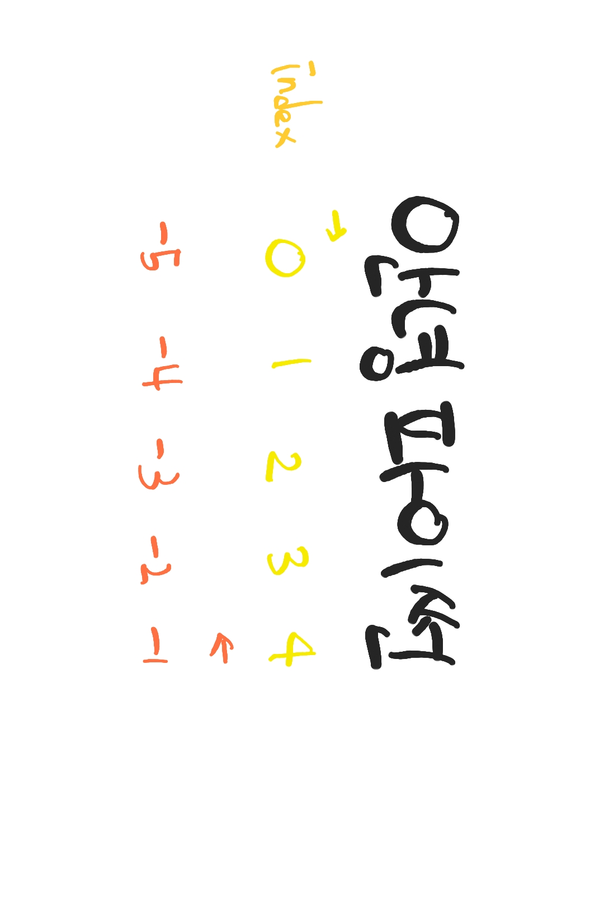

# 데이터 타입

## 숫자
### 수치형(Numeric Type)
#### 정수(Int)
- 모든 정수 타입은 int
- 오버플로우 발생X
#### 실수(Float)
- 정수가 아닌 모든 실수는 Float
- 부동소수점
  - 2진수로 숫자를 표현

- Floating point rounding error
  : 값을 비교하는 과정에서 실수인 경우 주의
  ```py
  # False
  3.14 - 3.02 == 0.12

  # 풀이
  3.14 - 3.02
  # 0.1200000000000001
  ```
  - 해결방안 : 1. 매우 작은 수 보다 작은지 확인 2. math 모듈 활용

  ```py
  # 1. 매우 작은 수 보다 작은지 확인 
  abs(a - b) <= 1e-10

  # 2. math 모듈 활용
  import math
  math.isClose(a,b)
  ```

#### 복소수(complex)
- 실수부와 허수부로 구성된 복소수의 타입은 complex

### 불린형(Boolean Type)
- True(= 1)/False(= 0) 값을 가진 타입
- 비교 연산에서 활용

### 연산자
#### 산술연산자
% : 나머지
// : 몫 
** : 거듭제곱

#### 복합연산자
- 선언과 할당이 동시에 일어남.
a += b => a = a+b

#### 비교 연산자
- 값을 비교하며, True / False 값을 리턴함.

#### 논리 연산자
- 논리식을 판단하여 True와 False 반환함.

- A and B => A와 B 모두 true일때만 True, 나머지 False
- A or B => A와 B 모두 false일때 false, 나머지 True
- not : 참과 거짓의 반대의 결과
ex) not ture => False

## None
- 값이 없음을 표현 하기위해 None타입이 존재함
- 반환값이 없는 함수에서 사용하기도 함.

## 컨테이너
  : 여러 개의 객체를 담을 수 있는 틀
### 시퀀스 (나열)
#### 문자열
- 모든 문자는 str 타입
- 작은 따옴표(')나 큰 따옴표(")를 활용
  - 하나의 문장부호를 선택하여 일관성을 유지
  - '문자열 안에 "큰 따옴표" 사용하기'
  - "문자열 안에 '작은 따옴표' 사용하기"
  - ''' 여러 줄 사용하기 '''

  ##### 인덱스 활용
  - 인덱스를 통해 특정 값에 접근할 수 있음.
  ```python
  hello = '안녕하세요'
  hello[0] = '안'
  hello[1] = '녕'
  ```
  - 슬라이싱
  > 문자열[시작 인덱스 번호 : 끝 인덱스 번호(포함X) : step]
  ```python
  hello = '안녕하세요'
  hello[1:3] # '녕하'
  hello[0:4:2] # '안하'
  ```
  - 결합/반복/포함
  ```python
  'hello ' + 'menduck'
  # 'hello menduck'

  'Hi' * 3
  # HiHiHi

  'a' in 'apple' # True
  'b' in 'apple' # False
  ```

#### 튜플
- 불변한 값들의 나열
- 순서를 가짐, 서로 다른 타입의 요소 가질 수 있음
- ***변경 불가능*** , 반복 가능
  - 추가/삭제도 불가능

- 소괄호 형태로 정의, 콤바로 구분

#### 리스트 => 배열
- 변경 가능한 값의 나열된 자료형
- 순서를 가지고 서로 다른 타입의 요소를 가질 수 있음
- ***변경 가능***, 반복 가능
- 대괄호 형태로 정의, 콤바로 구분

##### 생성과 접근
- 생성 : [] 혹은 list()를 통해 생성
```py
#1
my_list = []
type(my_list) # <class 'list>

#2 (권장X)
another_list = list()
type(another_list) # <class 'list>
```
- 접근 : 순서가 있는 시퀸스로 인덱스를 통해 접근 가능

```py
a = [1, 2, 3]
a[0] # 1

# 값 변경
a[0] = '아무개'
print(a) # ['아무개',2,3]
```
##### 리스트 값 추가/삭제
- 값 추가 : .append()
```py
even_numbers = [2,4,6,8]
even_numbers.append(10)
print(even_numbers) # [2,4,6,8,10]
```

- 값 삭제 : .pop()
```py
even_numbers = [2,4,6,8]
even_numbers.pop(0)
print(even_numbers) # [4,6,8]
```

#### 레인지
: 숫자의 나열

### 컬렌션/비시퀀스 (모음)
#### Set(세트, 집합)
- 유일한 값들의 모음
- 중괄호 혹은 set()을 통해 생성
  - 빈 Set을 만들기 위해 반드시 Set()으로 생성
- 순서가 없고 중복된 값이 없음
  - 별도의 값에 접근할 수 없음

- 변경 가능, 반복 가능
- 값 추가는 .add() / 값 삭제는 .remove()

##### set 활용 case
- 다른 컨테이너에서 중복된 값을 쉽게 제거 가능.
  - 주의! 순서가 무시되므로 순서가 중요하면 사용할 수 없음.

- 리스트에서 고유한 지역의 개수 구하는 법

```py
# set 사용하지 않는 방법
my_list = ['서울','서울','대전','광주','서울','대전','부산','부산']

result = []
for value in my_list :
  if value not in result :
    result.append(value)

print(len(result)) # 4

# set 사용
print(set(my_list)) # {'부산', '광주', '서울', '대전'} / 순서 무작위
print(len(set(my_list))) # 4
```

#### 딕셔너리
: 키와 값들의 모임
- 키(key) : 불변 자료형만 가능
  - 변경이 가능한 리스트, 딕셔너리 등은 불가능
- 값(values) : 어떠한 형태 상관없음
- 변경이 가능하고 반복 가능
  - 딕셔너리는 반복하면 key가 반환됨.

> 딕셔너리이름 = { key : value}

##### 딕셔너리 접근하기
```py
movie = {
  'title': '아바타',
  'genres' : ['SF','액션'],
  'adult' : False,
}

movie['genres'] # ['SF','액션']
movie['time'] # keyError
```

##### 딕셔너리 키 값 추가/변경/삭제
- 키와 값의 쌍을 추가 가능
- 값 변경 가능
- 키 삭제 가능 => .pop() 활용

```py
Lee = {'수학' : 100, '국어' : 80}

# 키와 값의 쌍 추가
Lee['영어'] = 100 
print(Lee) # {'수학': 100, '국어': 80, '영어': 100}

# 값 변경
Lee['국어'] = 75
print(Lee) # {'수학': 100, '국어': 75, '영어': 100}

# key 삭제
Lee.pop('수학')
print(Lee) # {'국어': 75, '영어': 100}
Lee.pop('미술') # keyError
```

##### 딕셔너리 순회
- 순회하면 key값을 반환

```py
Lee = {'수학': 100, '국어': 75, '영어': 100}

for subject in Lee:
  # 키 순회
  print(subject,end = ' ' ) # 수학 국어 영어 
  # 값 순회
  print(Lee[subject],end = ' ') # 100 75 100 
```